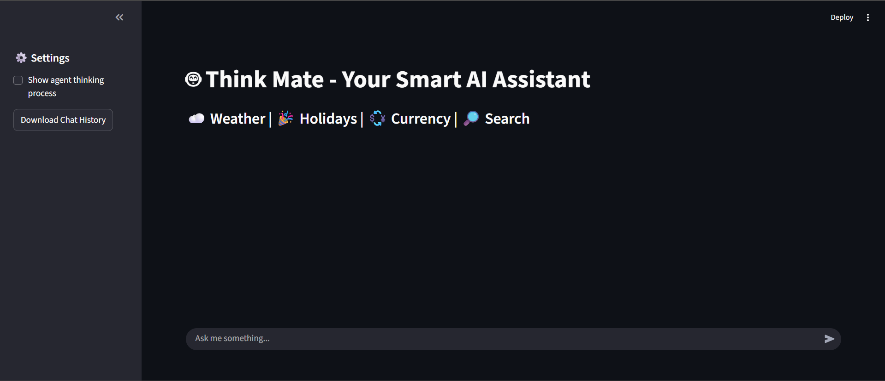
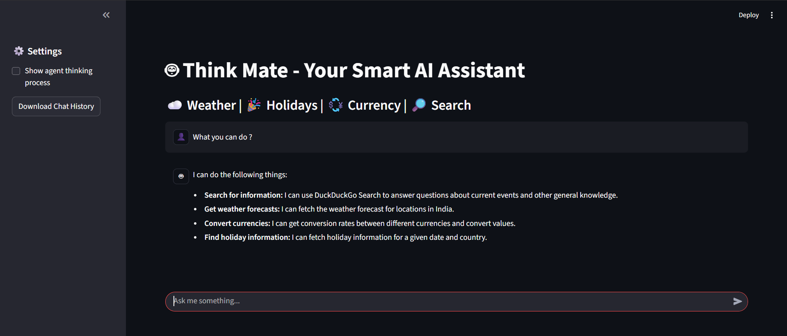
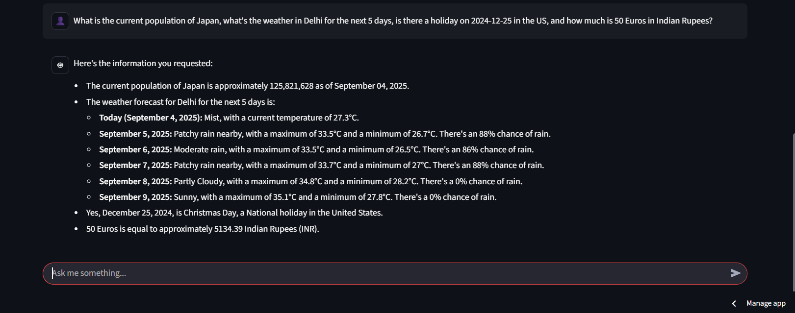

# ThinkMate – AI Agent with Tools  
  
 
 

ThinkMate is an **AI-powered chatbot** built with **LangChain, Google Gemini, and Streamlit**.  
It acts as a **multi-tool assistant** capable of answering queries, fetching real-time data, and maintaining chat history.  

---

##  Features  
-  **Chatbot with memory** – remembers previous messages for smooth conversations.  
-  **Web Search** – uses langchain's inbuilt tool "DuckDuckGosearch" to fetch latest information.  
-  **Weather Forecast** – get 3-day forecasts for any Indian city.  
- **Currency Conversion** – convert between currencies in real-time.  
- **Holiday Info** – check holidays for specific dates in India.  
- **Modern Chat UI** – built with Streamlit’s `st.chat_message`, avatars, and expanders.  
- **Debugging Logs** – expandable section to see the agent’s “thinking process”.  

---

##  Tech Stack  
- **Python 3.10+**  
- [Streamlit](https://streamlit.io/) – UI framework  
- [LangChain](https://www.langchain.com/) – agent & tool implementation  
- [Google Generative AI (Gemini)](https://ai.google/) – LLM for reasoning  
- [DuckDuckGoSearch](https://pypi.org/project/duckduckgo-search/) – search tool  
- **APIs used**:  
  - [Weather API](https://www.weatherapi.com/) 🌦️  
  - [ExchangeRate API](https://www.exchangerate-api.com/) 💱  
  - [Abstract API (Holidays)](https://www.abstractapi.com/holidays-api) 📅  

## Streamlit Website
- [Link](https://thinkmate.streamlit.app/)
